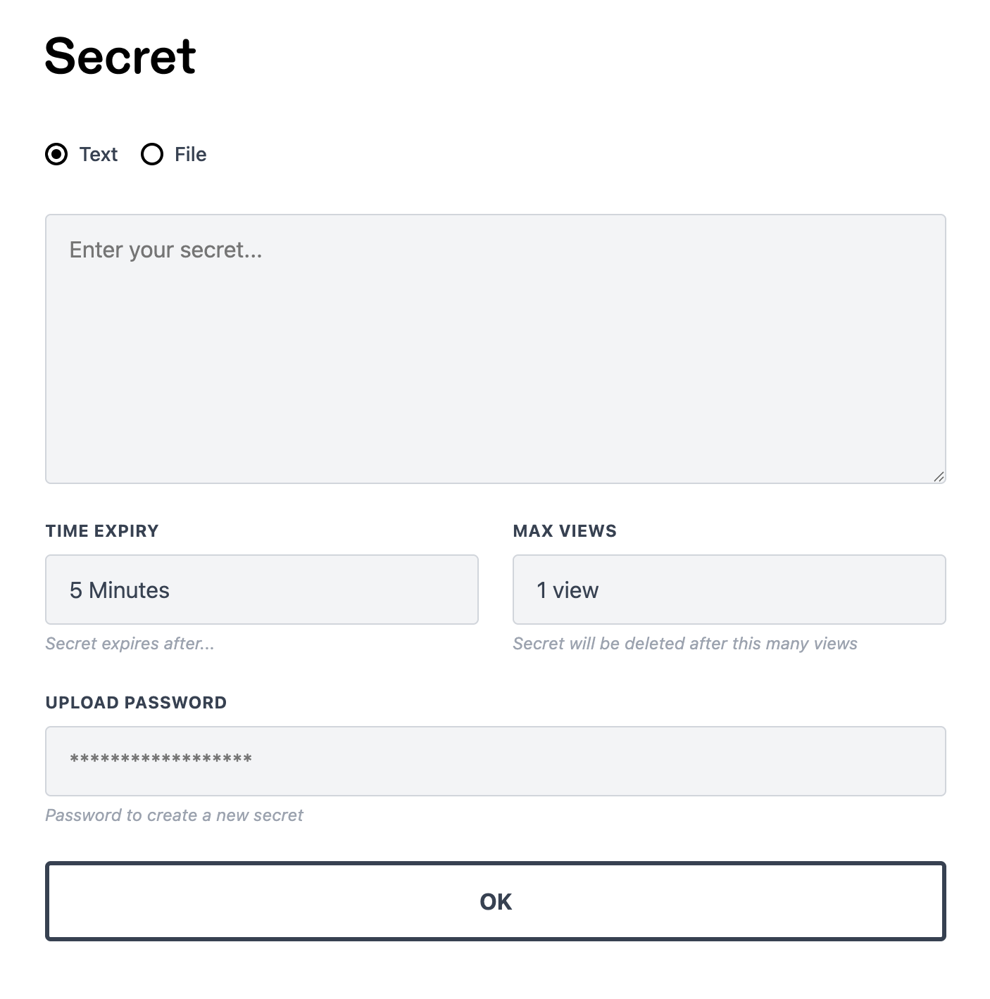

# Secret

A minimal PHP app for sharing sensitive text and files (like [onetimesecret](https://onetimesecret.com)), with full end-to-end AES-256-GCM encryption. The server never sees plaintext data as it is encrypted by a client-side key. Zero framework dependencies and incredibly simple to deploy.



## What is it for

Send credentials or sensitive information to clients and colleagues without it sitting forever in email/chat threads prone to breaches.

Secrets are encrypted client-side, viewed once, then deleted. For increased security, send the URL and KEY separately through different channels.

## Features

- End-to-end AES-256-GCM encryption (Web Crypto API)
- Text and file sharing (up to 10MB)
- Configurable expiry (5 minutes to 7 days)
- Auto-delete after viewing
- No framework, no Composer, no vendor directory
- SQLite database (auto-created)
- Deploy by uploading files to any PHP host

## Requirements

- PHP 8.0+ with PDO SQLite extension
- `mod_rewrite` (Apache) or equivalent URL rewriting
- [HTTPS with a proper certificate](https://developer.mozilla.org/en-US/docs/Web/API/SubtleCrypto) (required for Web Crypto API)

## Install

1. Clone the repo
2. Copy `.env.example` to `.env`
3. Configure `NEW_ITEM_PASSWORD` (recommended — see [Why set a password?](#why-set-a-password))
4. Point your web server's document root to the `public/` directory
5. That's it. The SQLite database is created automatically on first request.

## Deploy

Upload these to your server:

```
public/       <- document root
views/
.env
```

No `composer install`. No `npm install`. No build step. No dependencies at all.

## Customising

- **Logo/header**: Replace `public/images/header.png` with your own image.
- **Colours, fonts, spacing**: Edit the CSS custom properties at the top of `public/css/app.css`.
- **Client-side logic**: Edit `public/js/app.js` directly.

No build step required.

## Routes

| Method | URL | Purpose |
|--------|-----|---------|
| `GET` | `/` | Create secret form |
| `POST` | `/api/secret` | Create a new secret (JSON) |
| `GET` | `/s/{id}` | View/decrypt secret page |
| `GET` | `/api/secret/{id}` | Fetch encrypted data (JSON) |
| `DELETE` | `/api/secret/{id}` | Delete a secret |

## Why Set a Password?

- Without a password, anyone can create secrets
- There's no rate limiter, so a troll could hammer the endpoint
- There's no CSRF protection (irrelevant without a password since anyone can create secrets anyway)
- Sanitization is performed client-side before display (configured via `ALLOWED_TAGS` env var) since the server only sees encrypted data

## License

[GNU General Public License version 2](https://opensource.org/licenses/GPL-2.0)
